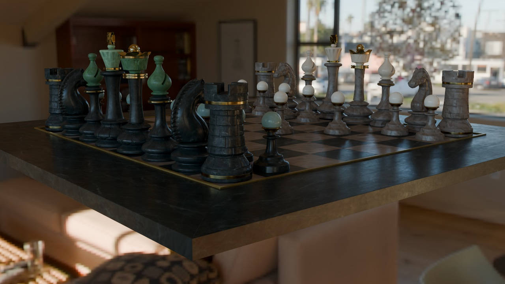
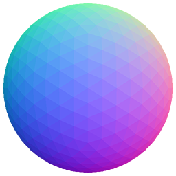

# Differentiable Render Pipelines `diffrp`

DiffRP aims to provide an easy-to-use programming interface for **non-differentiable and differentiable** rendering pipelines.

[[Documentation]](https://diffrp.rtfd.io)
[[Test Suite]](https://github.com/eliphatfs/diffrp-tests)


*Rendered with DiffRP.*

## Installation

The package can be installed by:

```bash
pip install diffrp
```

### Note

DiffRP depends on PyTorch (`torch`). The default version `pip` resolves to may not come with the `cuda` version you want. It is recommended to install [PyTorch](https://pytorch.org/get-started/locally/#start-locally) before you install DiffRP so you can choose the version you like.

DiffRP rendering is based on CUDA GPUs. You can develop without one, but a CUDA GPU is required to run the code.

### Other Dependencies

If you use rasterization in DiffRP, you need to have the CUDA development kit set up as we use the `nvdiffrast` backend. See also [https://nvlabs.github.io/nvdiffrast/#installation](https://nvlabs.github.io/nvdiffrast/#installation).

If you want to use hardware ray tracing in DiffRP, you need to install `torchoptix` by `pip install torchoptix`. See also the hardware and driver requirements [https://github.com/eliphatfs/torchoptix?tab=readme-ov-file#requirements](https://github.com/eliphatfs/torchoptix?tab=readme-ov-file#requirements).

If you plan on using plugins in DiffRP (currently when you compute tangents), `gcc` is required in path. This is already fulfilled in most Linux and Mac distributions. For Windows I recommend the Strawberry Perl [(https://strawberryperl.com/)](https://strawberryperl.com/) distribution of `gcc`.

## Get Started

Rendering attributes of a mesh programmingly is incredibly simple with DiffRP compared to conventional render engines like Blender and Unity.

In this section, we will get started to render a simple procedural mesh.

First, let's import what we would need:

```python
import diffrp
import trimesh.creation
from diffrp.utils import *
```

We now create a icosphere and render the camera space normal map, where RGB color values in $[0, 1]$ map linearly to $[-1, 1]$ in normal XYZ vectors.

The first run may take some time due to compiling and importing the `nvdiffrast` backend. Following calls would be fast.

```python
# create the mesh (cpu)
mesh = trimesh.creation.icosphere(radius=0.8)
# initialize the DiffRP scene
scene = diffrp.Scene()
# register the mesh, load vertices and faces arrays to GPU
scene.add_mesh_object(diffrp.MeshObject(diffrp.DefaultMaterial(), gpu_f32(mesh.vertices), gpu_i32(mesh.faces)))
# default camera at [0, 0, 3.2] looking backwards
camera = diffrp.PerspectiveCamera()
# create the SurfaceDeferredRenderSession, a deferred-rendering rasterization pipeline session
rp = diffrp.SurfaceDeferredRenderSession(scene, camera)
# convert output tensor to PIL Image and save
to_pil(rp.false_color_camera_space_normal()).save("procedural-normals.png")
```

Only 6 lines of code and we are done! The output should look like this:



The GPU buffers can be replaced by arbitrary tensors or parameters, and the process has been fully differentiable.

## More

Please refer to the [[Documentation]](https://diffrp.rtfd.io) for more features!
