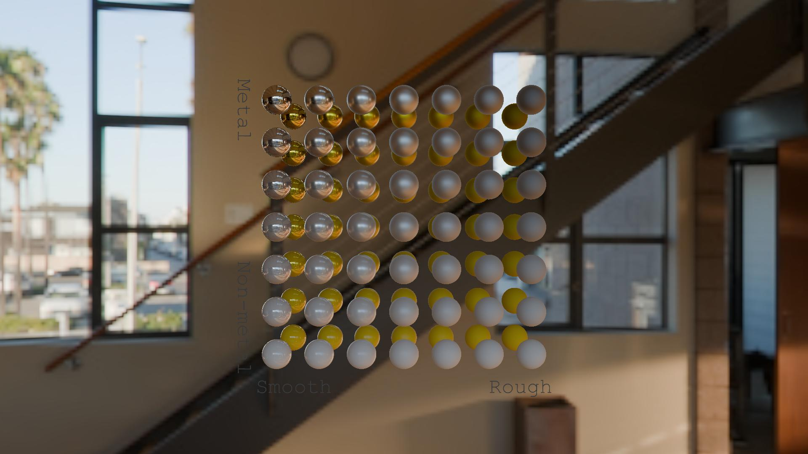

# Rendering glTF (*.glb) files

Short for *GL Transmission Format*, [glTF](https://github.com/KhronosGroup/glTF) has become a standardized format choice of 3D content. DiffRP implements a {py:class}`GLTFMaterial<diffrp.materials.gltf_material.GLTFMaterial>` that covers all features of the glTF 2.0 specification.

In this section, we will render the [MetalRoughSpheresNoTextures](https://github.com/KhronosGroup/glTF-Sample-Assets/blob/main/Models/MetalRoughSpheresNoTextures/README.md) scene from glTF sample asset library to walk through basic rendering features of DiffRP. You can download the scene from the link above or as a zip file {download}`here<assets/spheres.zip>`.

## Steps

### 1. Loading the Scene

DiffRP includes an easy method to load a GLB file into a scene.

```python
from diffrp.loaders.gltf_loader import load_gltf_scene

scene = load_gltf_scene("spheres.glb")
```

### 2. Creating a Camera

We can create an orbital camera within DiffRP to look at the center of the scene. The scene is small so we place the camera quite close to the spheres.

```python
from diffrp.rendering.camera import PerspectiveCamera

camera = PerspectiveCamera.from_orbit(
    h=1080, w=1920,  # resolution
    radius=0.02, azim=0, elev=0,  # orbit camera position, azim/elev in degrees
    origin=[0.003, 0.003, 0],  # orbit camera focus point
    fov=30, near=0.005, far=10.0  # intrinsics
)
```

You can also inherit and implement the {py:class}`Camera<diffrp.rendering.camera.Camera>` class to implement your own camera data provider. You need to implement the `V()` and `P()` methods to provide GPU tensors of the projection matrix and the view matrix **in OpenGL convention**.

### 3. Create the Render Session

Now let's create the render session that is the core for rendering in DiffRP.

Rendering sessions are designed to be short-lived in DiffRP. Each frame that has a different scene or camera setup should have its own new render session.

```python
from diffrp.rendering.surface_deferred import SurfaceDeferredRenderSession

rp = SurfaceDeferredRenderSession(scene, camera)
```

### 4. Rendering Normals and BRDF Parameters

Now that we have the render session, rendering is very straightforward:

```python
nor = rp.false_color_camera_space_normal()
mso = rp.false_color_mask_mso()
```

`mso` represents to **m**etallic, **s**moothness and ambient **o**cclusion attributes in a common PBR BRDF material. These are also defined in the glTF specification.

The outputs are tensors of shape $[H, W, 4]$ that linearly represent the attributes, in RGBA order, and RGB represents XYZ or MSO in the case, respectively. Normals are mapped from $[-1, 1]$ into $[0, 1]$ so the results are valid LDR RGB images. Alpha is transparency.

You can also obtain the raw normal vectors without mapping to RGB values:

```python
rp.camera_space_normal()
```

As a syntactic sugar injected by DiffRP, you can obtain the `xyz` or `rgb` channels in a tensor by simply using the `.` syntax:

```python
nor.xyz
nor.rgb
nor.a
nor.rgb * nor.a
```

Single channel dims are kept for broadcastability.

Note however the values are undefined in transparent regions. You may would like to composite with a background color if you need it:

```python
from diffrp.utils import background_alpha_compose

background_alpha_compose([0.5, 0.5, 0.5], nor)
background_alpha_compose(0.5, nor)
```

Both of these commands would place a gray background for the normal map, which refers to a zero normal vector.

### 5. Reading the Image

If you need to save or export the renders, DiffRP provides a utility method `to_pil` to convert the results from GPU Tensors into PIL Images. Only LDR RGB/RGBA images are supported.

```python
from diffrp.utils import to_pil

to_pil(nor).show()
to_pil(mso).show()
```


```{figure} assets/spheres-attrs.jpg
:scale: 45%
:alt: Spheres attributes rendered.

*A light gray background is added for more clarity of the MSO attributes.*
```

### 6. Rendering Albedo or Base Color

Rendering the albedo or base color of the method is just as straightforward as other parameters. However, you need to take care of the color space.

To be physically correct, all operations on True Colors, including albedo/base color, are in linear space.

```python
albedo = rp.albedo()  # albedo in linear space
```

If you need to output the albedo in sRGB space (the space your PNG files are in), you need to convert it. DiffRP can do it for you:

```python
albedo_srgb = rp.albedo_srgb()
to_pil(albedo_srgb).show()
```

You can also call the lower level color space utility yourself:

```python
from diffrp.utils import linear_to_srgb, float4
float4(linear_to_srgb(albedo.rgb), albedo.a)
```

More color space utilities can be found in {py:mod}`diffrp.utils.colors`.

The result should look like:

```{figure} assets/spheres-albedo-srgb.png
:scale: 45 %
:alt: Spheres Albedo render.
```

### 7. Other Attributes

DiffRP also supports other attributes that may or may not be represented as an LDR RGB image.
Here we list these useful methods including those we cover in other sections of this tutorial.
Please see the relevant API reference in {py:class}`diffrp.rendering.surface_deferred.SurfaceDeferredRenderSession` for details explaining the attributes.

The methods all return (H, W, C) full-screen renders.

```python
rp.aov('my_aov', [0.])
rp.albedo()
rp.albedo_srgb()
rp.emission()
rp.pbr()
rp.false_color_camera_space_normal()
rp.false_color_world_space_normal()
rp.false_color_mask_mso()
rp.false_color_nocs()
rp.camera_space_normal()
rp.world_space_normal()
rp.local_position()
rp.world_position()
rp.depth()
rp.distance()
rp.view_dir()
```

### 8. PBR Rendering

Currently, DiffRP supports fully differentiable Image-based lighting in the deferred shading pipeline. The support for directional and point lights will be added soon.

Let's add an DiffRP built-in HDRI as the ambient lighting into our scene:

```python
import torch
from diffrp.scene import ImageEnvironmentLight
from diffrp.resources.hdris import newport_loft

scene.add_light(ImageEnvironmentLight(intensity=1.0, color=torch.ones(3, device='cuda'), image=newport_loft().cuda()))
```

A tint color can be specified in the `color` parameter as you like. Note that the tensors needs to be on GPUs.

```{note}
You can use your own HDRI environment. DiffRP accepts images in Lat-Long format (usually the width is double the height).

If you load it from a PNG/JPG file, you usually need to convert it from sRGB to Linear space.
```

Now recreate the render session as the scene has been changed:

```python
rp = SurfaceDeferredRenderSession(scene, camera)
```

Now we can issue the rendering call just as simple as before:

```python
pbr = rp.pbr()
to_pil(pbr).show()
```

```{figure} assets/spheres-pbr-linear-hdr.jpg
:scale: 25 %
:alt: PBR raw HDR output in linear space.
```

### 9. Post-processing: Tone-mapping and Anti-aliasing

The previous image seems weirdly dark. It is due to we are in HDR linear space, but we are viewing it as a LDR sRGB PNG image, which is the wrong color space.

The procedure of converting an HDR image into LDR is called tone-mapping. DiffRP efficiently implements the state-of-the-art [AgX](https://github.com/sobotka/AgX) tone-mapper in a differentiable manner.

```python
from diffrp.utils import agx_base_contrast
pbr = agx_base_contrast(pbr.rgb)
```

The result would be a valid RGB image in sRGB space.

We are simply discarding the alpha channel as we have the environment map as the background. You can specify `render_skybox=False` in the `ImageEnvironmentLight` to render a transparent-film PBR image. You will then have to keep the alpha channel (see the example code for albedo) or compose with your background (see the example code for normal map) during tone-mapping.

At this final stage, we may also apply anti-aliasing.

DiffRP integrates the AA operation in `nvdiffrast` to provide visibility-based gradients on the geometry.

```python
pbr_aa = rp.nvdr_antialias(pbr)
to_pil(pbr_aa).show()
```

The order of anti-aliasing and tone-mapping leaves for your choice.

If you aim for higher rendering quality, you can also use a simple SSAA technique. That is, specify a higher resolution when rendering, and downscale at the end.

```python
from diffrp.utils import ssaa_downscale
pbr = ssaa_downscale(pbr, 2)
```

Note that anti-aliasing operations do not currently support transparency.


### 9+. Transparent Film

To disable the background to obtain a useful alpha mask, you can use the ``render_skybox`` parameter when adding environment light:

```python
scene.add_light(ImageEnvironmentLight(intensity=1.0, color=torch.ones(3, device='cuda'), image=newport_loft().cuda(), render_skybox=False))
```

During tone mapping, you need to keep the alpha channel unchanged.

```python
from diffrp.utils import agx_base_contrast, float4
pbr = rp.pbr()
pbr = float4(agx_base_contrast(pbr.rgb), pbr.a)
```

After that, you may also compose with a white background if you like:

```python
from diffrp.utils import background_alpha_compose
pbr = background_alpha_compose(1, pbr)  # input pbr 4 channels rgba, output 3 channels rgb
```


### 10. Handling Semi-Transparency (Optional)

Theoretically, alpha blending is not a physical behavior. It is an inaccurate approximation of transmission and refraction.
Thus, it is usually counter-intuitive and tricky to handle semi-transparency in PBR rasterization pipelines.

Firstly, you need to disable opaque geometry only mode
(this is made the default as rendering semi-transparency is much more compute and memory-intensive, and is rarely used for differentiable rasterization):

```python
rp = SurfaceDeferredRenderSession(scene, camera, opaque_only=False)
```

This makes the render pipeline support semi-transparency, and it works if you have a environment background image.

For transparent films, you may also go with the simple handling described in section 9+, but we may do a little bit better.
A more delicate handling of semi-transparency in terms of alpha values will require deeper analysis into the pipeline.

For PBR rendering, HDR radiance values are composed, instead of LDR colors.
This is the tricky part as alpha-blending itself makes no physical sense for HDR radiance values.

We can however assume that alpha linearly dims the radiance values (note that this assumption makes some sense but is not physically accurate),
which makes the blending consistent with pre-multiplied alpha in traditional alpha-blending.
Pre-multiplied means that the RGB values are multiplied with alpha when stored, which is already the final color contribution.
This is in contrast to straight alpha which means RGB values are the raw colors, which is usually what happens in PNG files and other storage formats.
By default, DiffRP also treats alpha as straight alpha.

It is also easy to do pre-multiplied alpha blending with DiffRP instead.
We just need to start with zeros in the color buffer when composing instead of starting with values in the last buffer.

```python
pbr_premult = rp.compose_layers(
    rp.pbr_layered() + [torch.zeros([1080, 1920, 3], device='cuda')],
    rp.alpha_layered() + [torch.zeros([1080, 1920, 1], device='cuda')]
)
```

The RGB values now represent a more accurate radiance value according to the assumption (that alpha linearly dims radiance).
However, the value is "pre-multiplied" and makes no sense if combined with a straight alpha,
so this is not made the default behavior in the ``SurfaceDeferredRenderSession``.
To display the image in viewers with the expected colors, you need to convert premultiplied alpha to straight alpha after tone mapping.
You may also want to saturate the colors (clamping into [0, 1]) to keep it valid in LDR space.

```python
from diffrp.utils import saturate, ssaa_downscale
pbr = ssaa_downscale(pbr_premult, 2)
pbr = saturate(float4(agx_base_contrast(pbr.rgb) / torch.clamp_min(pbr.a, 0.0001), pbr.a))
```

However, the colors will be slightly off if the colors are actually clamped (larger than 1 before clamping).
This is a limitation of traditional LDR images with straight alpha.

You can also convert the premultiplied alpha to straight alpha before tone mapping.
There is an approximation in the tone mapper this way as the input is no longer a physical radiance value for semi-transparent regions,
but you won't introduce errors when clamping the outputs.

```python
pbr = float4(agx_base_contrast(pbr.rgb / torch.clamp_min(pbr.a, 0.0001)), pbr.a)
```

Note that in both ways, you should handle anti-aliasing in premultiplied space.

Also, to put it again, alpha blending is a non-physical approximation to the transmission and refraction of light.
Thus, there is no "correct way" to handle alpha (other than extreme values of 0 and 1) together with a PBR pipeline.

All of the above ways make different assumptions for semi-transparency, and all of them are correct if all alpha values are either 0 or 1,
including the simple method described in Section 9+.


## Complete Example



```python
import torch
from diffrp.resources import hdris
from diffrp.scene import ImageEnvironmentLight
from diffrp.utils import to_pil, agx_base_contrast
from diffrp.rendering.camera import PerspectiveCamera
from diffrp.loaders.gltf_loader import load_gltf_scene
from diffrp.rendering.surface_deferred import SurfaceDeferredRenderSession


scene = load_gltf_scene("spheres.glb")
scene.add_light(ImageEnvironmentLight(
    intensity=1.0, color=torch.ones(3, device='cuda'),
    image=hdris.newport_loft().cuda()
))

camera = PerspectiveCamera.from_orbit(
    h=1080, w=1920,  # resolution
    radius=0.02, azim=0, elev=0,  # orbit camera position, azim/elev in degrees
    origin=[0.003, 0.003, 0],  # orbit camera focus point
    fov=30, near=0.005, far=10.0  # intrinsics
)

rp = SurfaceDeferredRenderSession(scene, camera)
pbr = rp.pbr()

pbr_aa = rp.nvdr_antialias(pbr.rgb)
to_pil(agx_base_contrast(pbr_aa)).save("sphere-output.jpg")
```
