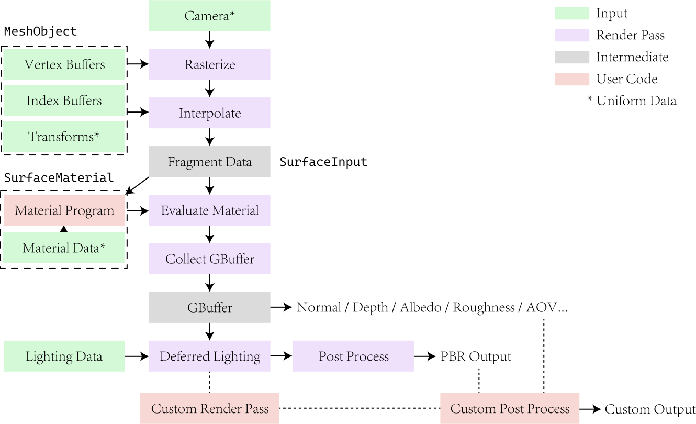

# Surface Deferred Render Pipeline

This diagram shows the pipeline for {py:class}`diffrp.rendering.surface_deferred.SurfaceDeferredRenderSession`.

Most rendering requirements can be fulfilled by only coding the material by implementing a {py:class}`diffrp.materials.base_material.SurfaceMaterial`. If more advanced render passes are wanted, you may extend the {py:class}`diffrp.rendering.surface_deferred.SurfaceDeferredRenderSession` class by inheriting from it. The dependencies shown as arrows here in the diagram is implicitly solved by the cache system, and can be requested by calling relevant functions. Of course, you can also implement custom post processing outside the render session after obtaining the results.

## Glossary

### GBuffer

GBuffer is a common word for screen buffers for intermediate results in this render pipeline.

Typically, we collect all information needed for the final image about objects in GBuffer, and handle lighting after we have the GBuffer. This is to decouple the complexity of objects with lights. In other words, GBuffer is a comprehensive summary of all visible objects in the screen space.

GBuffer contain normals, PBR parameters (metallic, smoothness, occlusion), base color (albedo), alpha (transparency) and positions in DiffRP. They can be easily mapped into normals in various spaces (camera space, world space), NOCS, depth/distance values, which are common modalities needed for differentiable rendering projects.
